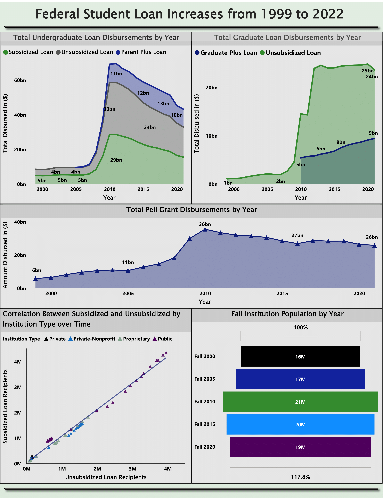

# Financial Aid Analysis Over 20 Years
This project extracts and analyzes financial aid loan/grant increases over time. Below one will find all relevant information pertaining to the project:

### Data Sources:

Data for this project was pulled from the following two websites:

* Studentaid.gov - Title IV Program Volume Reports [https://studentaid.gov/data-center/student/title-iv#award-year-summaries]

* National Ceneter for Education Statistics - Fall Enrollments [https://nces.ed.gov/ipeds/SummaryTables/report/201?templateId=2010&years=2021,2020,2019,2018,2017,2016,2015,2014,2013,2012,2011,2010,2009,2008,2007,2006,2005,2004,2003,2002,2001,2000,1999&tt=institutional&instType=1&sid=a3bc80bc-b5a3-4934-974e-3b814cc0e2d1]

### Technologies

* Python
* SQL (DDL and DML)
* Pandas, Numpy
* Power BI
* Power Query
* Azure Data Studio
* VS Code
* Docker

### Methods

This project’s purpose is to see how drastic Title IV funding has increased over the last 20 years.
On the Studentaid.gov website, over 40 excel files were downloaded to obtain the raw data needed.

From there, Python code was used to extract all relevant sheets and information from the files, to then be concatenated into a data frame for loans and grants respectively. 

After, the datasets were then imported to a SQL Server database where they underwent normalization. 

From there, the database was imported into PowerBI to create visualizations.

#### Entity Relationship Diagram for SQL Database 

#### PowerBI Dashboard 

### Conclusions/Findings

As with many reports much more data is needed to draw and conclusive results.
However, within the findings, one can see that in 2010 there was a major hike in recipients of all types of Title IV loans.

Within this same year, we can see that Graduate Plus loans were also introduced, which can be indicative of rising education costs being supplemented by higher interest federal loans. 

The population of student enrollments has not increased enough to account for so many new recipients of loans, especially in undergraduate programs. Also, Pell grant recipients increased as well, showing that more and more students have required all exisiting funds to afford education. 

Here is a helpful article from February 2010 noticing increases expected for the upcoming academic year. CNN Money [https://money.cnn.com/2010/02/24/news/economy/public_tuition_soars/index.htm]

Again, much more data would be needed to make any definite conclusions, however it is apparent student loan recipients have increased at a substantial rate over the last 13 years.

### Definitions and Helpful Information: 

#### Loans

Direct Subsidized Loans - do not accrue interest while student is attending school, credit check not required

Direct Unsubsidized Loans - begin accuring interest as soon as taken out by student, credit check not required

Direct PLUS Loans - begin accuring interest as soon as taken out by student, credit check required 

Direct PLUS Loans are additional loans offered by the Department of Education, Parent Plus Loans require passing a credit check and the loan is then under the parents name. 
Graduate Plus loans also require a credit check, the loan is under the student name(only avaiable for graduate students).

Direct Subsidized Loans and Direct Unsubsidized Loans: Borrowed by undergraduate students, current interest rate is 4.99%

Direct Graduate Unsubsidized Loans: Borrowed by graduate students, current interest rate is 6.54%

Direct PLUS Loans: This includes Parent Plus Loan and Graduate Plus Loan, current interest rate is 7.54%
